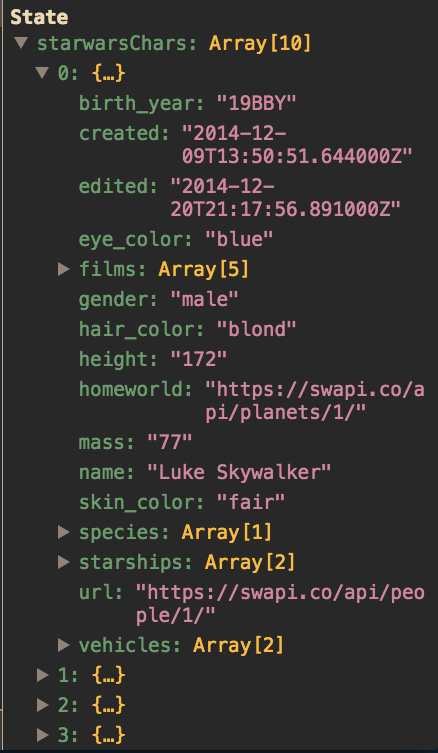

# Sprint Challenge: React - Star Wars

This challenge allows you to practice the concepts and techniques learned over the past Sprint and apply them in a concrete project. This Sprint explored ReactJS, Functional Components and Class Components. In your challenge for this Sprint, you will demonstrate proficiency by creating an application that uses ReactJS to consume live data retrieved from the World Wide Web and style that data nicely on the page.

## Instructions

**Read these instructions carefully. Understand exactly what is expected _before_ starting this Sprint Challenge.**

This is an individual assessment. All work must be your own. Your challenge score is a measure of your ability to work independently using the material covered through this sprint. You need to demonstrate proficiency in the concepts and objectives introduced and practiced in preceding days.

You are not allowed to collaborate during the Sprint Challenge. However, you are encouraged to follow the twenty-minute rule and seek support from your PM and Instructor in your cohort help channel on Slack. Your work reflects your proficiency ReactJS Fundamentals and your command of the concepts and techniques in the Function Components and Class Components.

You have three hours to complete this challenge. Plan your time accordingly.

## Commits

Commit your code regularly and meaningfully. This helps both you (in case you ever need to return to old code for any number of reasons and your project manager.

## Description

In this challenge, create a web page that presents a styled list of Star Wars characters. Being able to render out data to a web page is a large part of what JavaScript developers do, this challenge assesses your ability to achieve such a task.

## Self-Study/Essay Questions

Demonstrate your understanding of this Sprint's concepts by answering the following free-form questions. Edit this document to include your answers after each question. Make sure to leave a blank line above and below your answer so it is clear and easy to read by your project manager.

- [ ] What is React JS and what problems does it try and solve? Support your answer with concepts introduced in class and from your personal research on the web.

React is a UI library that is used in various forms to create complex, rich user interfaces. Facebook had a need to build something that could power their user experiences in such a way that was decoupled and unconcerned when and where the data was received.
DOM operations are quite expensive in terms of performance, and any application that has much of DOM operations in the background will render slowly.
React solves this problem, without even having the page reload. It does by a concept called virtual DOM. When a page is rendered using React, the state of the DOM tree structure/hierarchy is stored, and when there any updates to be made to the UI, it does a diff on the previous (old) DOM tree with the new one, and updates only the ones that have changed. In this way, lots of DOM operations/refreshes are reduced, improving performance considerably.

- [ ] What does it mean to _think_ in react?

One of the many great parts of React is how it makes you think about apps as you build them. 
Step 1: Break The UI Into A Component Hierarchy
The first thing you’ll want to do is to draw boxes around every component (and subcomponent) in the mock and give them all names. If you’re working with a designer, they may have already done this, so go talk to them! Their Photoshop layer names may end up being the names of your React components!
Step 2: Build A Static Version in React
Now that you have your component hierarchy, it’s time to implement your app. The easiest way is to build a version that takes your data model and renders the UI but has no interactivity. It’s best to decouple these processes because building a static version requires a lot of typing and no thinking, and adding interactivity requires a lot of thinking and not a lot of typing.
Step 3: Identify The Minimal (but complete) Representation Of UI State
To make your UI interactive, you need to be able to trigger changes to your underlying data model. React makes this easy with state.
Step 4: Identify Where Your State Should Live
For each piece of state in your application:
Identify every component that renders something based on that state.
Find a common owner component (a single component above all the components that need the state in the hierarchy).
Either the common owner or another component higher up in the hierarchy should own the state.
If you can’t find a component where it makes sense to own the state, create a new component simply for holding the state and add it somewhere in the hierarchy above the common owner component.
Step 5: Add Inverse Data Flow
So far, we’ve built an app that renders correctly as a function of props and state flowing down the hierarchy. Now it’s time to support data flowing the other way: the form components deep in the hierarchy need to update the state in FilterableProductTable.


- [ ] Describe state.

Components data will be stored in component's State. This state can be modified based on user action or other action. when a component state is changed React will re-render the component to the browser.
`state` is a heart of an application that takes blood which is `props` and passes around our application so it can live.
`state` is the data that we have when we need it.
 It's just an `object` that we reference on the `this` keyword.
`state` can be changed via the `setState` method.

- [ ] Describe props.

First of all Props - is an object.
If `state` is a heart of an application so the `props` is a blood which is being passed around our application so it can live.
Unlike `state`, `props` are immutable. Meaning you cannot change the assignment but only read them.
They can be passed from the top down, or even bottom up through event handlers.

## Project Set Up

Follow these steps to set up and work on your project:

- [ ] Create a forked copy of this project.
- [ ] Add PM as collaborator on Github.
- [ ] Clone your OWN version of Repo (Not Lambda's by mistake!)
- [ ] Create a new Branch on the clone: git checkout -b `<firstName-lastName>`.
- [ ] Change directories into `./starwars` (`cd starwars`) and run `yarn install` to retrieve all needed dependencies.
- [ ] Once you have installed the _node_modules_, run `yarn start or` to get your server up and running.
- [ ] With the server up and running, open Chrome and head over to `localhost:3000` and view your beautiful app. Maybe it's not _that_ pretty... _yet_, your goal is to ensure this project becomes a thing of beauty.
Follow these steps for completing your project.
- [ ] Implement the project on this Branch, committing changes regularly.
- [ ] Push commits: git push origin `<firstName-lastName>`.

Follow these steps for completing your project:

- [ ] Submit a Pull-Request to merge <firstName-lastName> Branch into master (student's  Repo).
- [ ] Add your Project Manager as a Reviewer on the Pull-request.
- [ ] PM then will count the HW as done by  merging the branch back into master.

Please note:

- In `App.js`'s `componentDidMount()` method we call the public Star Wars API, which stores the result in the component state.
- Here's an excerpt of that logic:

```js
componentDidMount() {
  this.getCharacters('https://swapi.co/api/people');
}

getCharacters = URL => {
  fetch(URL)
    .then(res => {
      return res.json();
    })
    .then(data => {
      this.setState({ starwarsChars: data.results });
    })
    .catch(err => {
      throw new Error(err);
    });
};
```

- At a high level, this code is a common way to automatically load data from a remote server into a component.
- View your `App` component's `state` by opening the Chrome `React Dev Tools` to peek at the data set. At this point you will know what to do from here.

Your data set will look like this:




## Minimum Viable Product

Your finished project must include all of the following requirements:

- [ ] A list of Star Wars Characters rendered to the screen.
- [ ] You must have at least one list element for each star wars character in the data set.
- [ ] The list elements must all be minimally styled. (Don't rely on browser default styles.)

Required best practices:

- [ ] Consistent naming. Examples: variables, functions, classes, and files.
- [ ] Consistent spacing. Examples: line breaks, around arguments and before/after functions.
- [ ] Consistent quotation usage.
- [ ] Spell-check.
- [ ] Schedule time to review, refine and reassess your work.


It is better to submit a challenge that meets [MVP](https://en.wikipedia.org/wiki/Minimum_viable_product) than one that attempts too much and fails.

## Stretch Problems

- [ ] Build a pagination system that will allow you to load the next page of data

- Take note on the data that's coming back from the server call in our `getCharacters()`.
- console.log() the data coming back from the server.
- Notice that there are `next` `previous` fields that give you a URL.
- You have a function that will get chars called `getCharacters` you'll want to just call this function and supply it with the proper fields. You'll need to set this up on state to do this.

```js
 .then(data => {
    console.log(data); <-- Log data here to find the fields you will need.
    this.setState({ starwarsChars: data.results });
  })
```

- [ ] Build another app from scratch that looks very similar to this one. Inside of your main `App` component fetch some data in this same fashion from this url `https://dog.ceo/dog-api/#all` you'll have to follow the documentation at that website and figure out how to change up the code you've seen here in this Star Wars app in order to properly fetch the data and store it on Component State.

- Be mindful of the `fetch API` that is now built into most modern browsers [Fetch API](https://developer.mozilla.org/en-US/docs/Web/API/Fetch_API/Using_Fetch).
- Your data coming back from Dogs should be formatted in JSON format.
